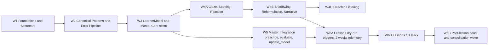

# Feedback Redesign — Implementation Plan

> **Status**: implementation plan (pre-execution)
> **Last updated**: 2026-04-20
> **Companion to**: [feedback-redesign.md](feedback-redesign.md) (the design contract)
> **Scope**: full v1 — F1 through F31, in six sequential waves
> **Purpose**: turn the design contract into a buildable sequence with concrete file-level tasks, acceptance criteria, tests, and rollback notes. Self-sufficient if the design doc is consulted alongside.

---

## 0. How to read this document

- [feedback-redesign.md](feedback-redesign.md) is the **design contract**: what we are building and why.
- This document is the **implementation plan**: how we build it, in what order, and how we know it works.
- Feature IDs (F1..F31), decisions (D-1..D-12), open questions (Q-1..Q-11) and risks (R-1..R-11) reference the design doc by ID — no renumbering.
- When a task spans several features, the primary feature ID appears in parentheses in the task title.
- Acceptance criteria are written as **observable outcomes**, not as code shape.

### Operational constraints

These constraints govern the execution window itself:

- **No Supabase CLI invocations.** SQL migrations are **authored as versioned files** under [supabase/migrations/](../supabase/migrations/) but never applied by the assistant. The project owner decides when to run `supabase:db:push`.
- **No GitHub pushes.** Local git commits are allowed and encouraged at wave boundaries. `git push` / `gh pr *` are out of scope.
- **No destructive schema changes.** Every migration is additive (new tables, nullable columns, `ADD COLUMN IF NOT EXISTS`). Legacy rows keep working.

### Design-doc correction folded in

The design doc claims `getTutorExplanationPrompt` is orphan code. It is actually wired in [src/components/review/ReviewPage.tsx](../src/components/review/ReviewPage.tsx) via `handleShowTutor`. Wave 1 fixes the design-doc wording and builds on the existing wiring rather than wiring from scratch.

---

## 1. Executive summary

We are delivering the redesign in six waves. Waves 1–3 are strictly sequential prerequisites. Waves 4–6 can overlap internally but Wave 6 Stage B (Lessons full stack) is gated on Wave 4 sub-waves A+B shipping and Wave 5 driving real prescriptions, per Q-9 in the design doc.

### Wave snapshot

| Wave | Primary goal | Ships | Blocked by |
| --- | --- | --- | --- |
| W1 | Multidimensional feedback surface | 5D scorecard, FeedbackDrill, on-demand explainer, contextual tone | — |
| W2 | Reliable error vocabulary | Canonical patterns, rewritten error pipeline, dashboard update, migration | W1 |
| W3 | Silent pedagogical substrate | `learner_models` schema, patch protocol, feature flag, telemetry, manual reset | W2 |
| W4 | Richer exercise palette | 7 new modalities in 3 sub-waves (A, B, C); E8 deferred | W3 (plumbing only), W2 (canonical patterns) |
| W5 | Master drives content | `prescribe`, `evaluate`, `update_model`, modality router, diagnostic cold-start, frustration detection, stealth guards | W3, W4B |
| W6 | Lessons | Stage A dry-run + Stage B full stack + consolidation wave | W4B, W5 |

### Guiding principles across waves

1. **Backward compatibility is non-negotiable.** Every schema and type change adds optional fields or nullable columns. Legacy rows continue to render without errors.
2. **Every Master code path is feature-flag-gated.** `if (!masterEnabled()) return null` on every service entry.
3. **Stealth is enforced by tests, not trust.** A regex-based stealth detector ships in Wave 5 and is extended in Wave 6; it runs in CI.
4. **Migrations are authored, not applied.** Every migration lands as a versioned SQL file. Running them is the project owner's decision.
5. **Each wave ends reviewable.** A human can stop at the end of any wave and have a working app.

---

## 2. Wave 1 — Foundations & Scorecard (F1–F8 subset + doc corrections)

**Primary goal**: make the student-facing feedback multidimensional and actionable **without** introducing the Master. Every change stays backward-compatible with legacy evaluation rows.

### 2.1 Prerequisites

- None at the code level.
- Design-doc drift to fix first (see 2.2.1).

### 2.2 Tasks

#### 2.2.1 Correct design-doc drift (housekeeping)

- [feedback-redesign.md](feedback-redesign.md): remove the claim that `getTutorExplanationPrompt` is unused orphan code. Note in the changelog that the existing wiring in [src/components/review/ReviewPage.tsx](../src/components/review/ReviewPage.tsx) `handleShowTutor` is the base we extend.

#### 2.2.2 Extend `EvaluationResult` for 5D scores (F1)

- File: [src/types/card.ts](../src/types/card.ts).
- Add optional fields: `scores5d?: { naturalness: number; accuracy: number; fluency: number; pragmatics: number; completeness: number }` and `primaryDimension?: keyof EvaluationResult['scores5d']`.
- Keep legacy `score: number` for backward compat. Introduce a companion pure function `normalizeEvaluationResult(result)` that: (a) if `scores5d` is absent and `score` is present, fills 5D with the scalar scaled to 0–100 on every axis; (b) if `scores5d` is present and `score` is absent, derives `score` as the rounded average of the 5 axes.
- Keep `normalizeCorrectionItem` as is. Export both normalizers from the same file.

#### 2.2.3 Evaluation prompt + schema (F2)

- File: [src/utils/prompts.ts](../src/utils/prompts.ts).
- Extend `getEvaluationPrompt` to request `scores5d` and `primaryDimension` in the returned JSON. Keep `score` as a legacy top-level field for one release cycle (derived by the LLM or computed client-side as fallback).
- Extend `evaluationResponseSchema` to mirror the new shape exactly. Both locations must agree.
- **Consumers to update**:
  - [src/components/exercises/useExerciseEvaluation.ts](../src/components/exercises/useExerciseEvaluation.ts) — already uses `cleanJson`; pass the parsed result through `normalizeEvaluationResult`.
  - [src/components/discovery/ImageMode.tsx](../src/components/discovery/ImageMode.tsx) — same treatment; also fix the inconsistency where this mode does not call the error pipeline (addressed in Wave 2 §3.2.6).
  - [src/components/review/ReviewPage.tsx](../src/components/review/ReviewPage.tsx) — **also migrate to `cleanJson`** (today it parses raw JSON, which is an inconsistency). Then normalize.

#### 2.2.4 `ScorecardDisplay` component (F5)

- New file: `src/components/shared/ScorecardDisplay.tsx`.
- Renders 5 horizontal bars (one per dimension) plus a callout for `primaryDimension`. Bars use existing token colors (`--leaf`, `--amber`, `--danger`, `--brand-primary`) to signal strong/mid/weak bands. Tokens are defined in [src/index.css](../src/index.css).
- A11y: each bar is a `role="progressbar"` with `aria-valuemin/max/now` and a visible numeric label. The component is keyboard-navigable (tab order stable).
- Props: `{ scores: EvaluationResult['scores5d']; primaryDimension?: string; size?: 'sm' | 'md' | 'lg' }`.
- Keep [src/components/shared/ScoreDisplay.tsx](../src/components/shared/ScoreDisplay.tsx). Add a `@deprecated` JSDoc comment pointing to `ScorecardDisplay`, but do not delete — legacy consumers (e.g. `CardDetail`) still use it.

#### 2.2.5 Swap `ScoreDisplay` for `ScorecardDisplay` in `EvaluationResults` (F5)

- File: [src/components/shared/EvaluationResults.tsx](../src/components/shared/EvaluationResults.tsx).
- Render `ScorecardDisplay` when `result.scores5d` is populated, fall back to `ScoreDisplay` otherwise.
- Legacy evaluations saved to [Card](../src/types/card.ts) before this change continue to work (they only have `score`).

#### 2.2.6 FeedbackDrill component (F6)

- New file: `src/components/shared/FeedbackDrill.tsx`.
- Three sequential states: `show` (student hears their own transcription, then hears the corrected version via `useTTS`), `diff` (inline visual diff of user vs corrected text, with key words highlighted), `record` (student re-records the corrected version; a second lightweight evaluation runs to confirm the drill was effective).
- Uses [useAudioRecorder](../src/hooks/useAudioRecorder.ts) and [useTTS](../src/hooks/useTTS.ts).
- Includes a persistent "Pular para feedback completo" button that skips directly to the full `EvaluationResults`.
- Integration:
  - In solo exercise shell ([src/components/exercises/ExerciseShell.tsx](../src/components/exercises/ExerciseShell.tsx)): render `FeedbackDrill` **before** `EvaluationResults` when `result.score < 9` or `primaryDimension` ∈ {`accuracy`, `naturalness`}. Otherwise go straight to results.
  - In Review mode ([src/components/review/ReviewPage.tsx](../src/components/review/ReviewPage.tsx)): the drill is **opt-in** via a "Praticar a correção" CTA under the score. Rationale: existing review users have muscle memory; we do not force a new flow on them.
- The second micro-evaluation produced by the `record` state is persisted in Wave 5 into the `LearnerModel`; in Wave 1 it is stored only in component state.

#### 2.2.7 On-demand correction explanation (F7)

- New file: `src/services/tutorExplain.ts` (split from [openai.ts](../src/services/openai.ts) to keep concerns separate).
  - Exports `explainCorrection({ prompt, userTranscription, correctedVersion, correction, tone }): Promise<string>`.
  - Calls `chatCompletion` with `getTutorExplanationPrompt` (already exists in [prompts.ts](../src/utils/prompts.ts)).
- File: [src/components/shared/EvaluationResults.tsx](../src/components/shared/EvaluationResults.tsx).
  - Add a "Por quê?" inline toggle on each `CorrectionItem` row.
  - Lazy-fetches the explanation, caches per-row in component state, collapsed by default.
- The existing `handleShowTutor` button in [ReviewPage.tsx](../src/components/review/ReviewPage.tsx) now delegates to `tutorExplain.ts` instead of duplicating the call. Same for any future consumer.

#### 2.2.8 Contextual tone (F4)

- New file: `src/services/tone.ts`.
  - Exports `getEffectiveTone({ scenarioHints?, characterSpeechStyle?, exerciseType? }, globalTone): ConversationTone`.
  - Rules (initial, tunable):
    - A live-roleplay character with `characterSpeechStyle` containing "formal" / "professional" / "interview" overrides to `formal`.
    - An exercise with theme "café com amigos" / "conversa casual" leans `casual`.
    - Otherwise fall back to `globalTone`.
- Update every evaluation call site to pass the derived tone instead of pulling the global directly:
  - [src/components/exercises/useExerciseEvaluation.ts](../src/components/exercises/useExerciseEvaluation.ts)
  - [src/components/discovery/ImageMode.tsx](../src/components/discovery/ImageMode.tsx)
  - [src/components/review/ReviewPage.tsx](../src/components/review/ReviewPage.tsx)
  - [src/components/live-roleplay/ConversationAnalysis.tsx](../src/components/live-roleplay/ConversationAnalysis.tsx)
- Keep `getConversationTone()` (from [runtimeConfigSnapshot.ts](../src/services/runtimeConfigSnapshot.ts)) as fallback when no hints are available.

### 2.3 Tests

- Extend [src/services/errorAnalysis.test.ts](../src/services/errorAnalysis.test.ts) with fixtures asserting that legacy (no `scores5d`) and 5D evaluations both survive `normalizeEvaluationResult` + downstream aggregation.
- New `src/components/shared/ScorecardDisplay.test.tsx`: renders 5 bars; announces primary dimension; accessible by keyboard.
- New `src/components/shared/FeedbackDrill.test.tsx`: exercises the `show → diff → record` transitions and the skip escape.
- New `src/services/tone.test.ts`: table-driven tests for `getEffectiveTone`.

### 2.4 Acceptance criteria

- A student completing a solo exercise sees a 5-bar scorecard (not a single-number ring) with a primary-dimension callout.
- The drill appears before the full feedback for sub-9 scores with a visible escape to the full report.
- Each correction row exposes a "Por quê?" toggle that streams a concise explanation.
- Switching global tone no longer flattens scenario-specific feedback; a live roleplay in a formal interview returns formal-calibrated feedback even if the user's global tone is `casual`.
- Legacy cards (pre-W1 evaluations) still render without throwing.

### 2.5 Rollback notes

- Every new file is additive; reverting the commit undoes the wave cleanly.
- `ScoreDisplay` is not deleted, so if `ScorecardDisplay` misbehaves in production the fallback path still works.
- `tutorExplain.ts` is a thin wrapper; deleting it and re-inlining the call to `chatCompletion` at the one remaining consumer (ReviewPage) is trivial.

---

## 3. Wave 2 — Canonical Patterns & Error Pipeline

**Primary goal**: fix the structurally broken pattern aggregation in [errorAnalysis.ts](../src/services/errorAnalysis.ts) without losing existing rows, and introduce the pattern vocabulary the Master will use.

### 3.1 Prerequisites

- W1 complete (5D scorecard shipped; evaluation prompt and schema already touched).

### 3.2 Tasks

#### 3.2.1 Starter canonical pattern catalogue (addresses Q-1)

- New file: `src/services/patterns.ts`.
- Exports `CANONICAL_PATTERNS: Record<CanonicalPatternId, CanonicalPatternMeta>` and `CANONICAL_PATTERN_IDS: CanonicalPatternId[]`.
- `CanonicalPatternMeta`: `{ id, label_pt, label_en, category: ErrorCategory, cefr_min: 'A1'|'A2'|'B1'|'B2'|'C1'|'C2', description_pt }`.
- Starter set (~50 entries). Grouped by category, examples include:
  - **verb-tense**: `past_continuous_in_interrupted_narrative`, `present_perfect_since_vs_for`, `past_simple_vs_present_perfect_recent`, `future_going_to_vs_will`, `conditional_second_vs_third`, `used_to_vs_would_past_habits`.
  - **preposition**: `preposition_in_vs_on_time`, `preposition_at_vs_in_location`, `preposition_for_vs_since_duration`, `preposition_by_vs_until`, `preposition_on_the_weekend_us_vs_uk`.
  - **article**: `article_omission_generic_plural`, `article_the_with_unique_entities`, `article_a_vs_an_pronunciation`.
  - **word-order**: `adverb_frequency_position`, `adjective_order_attributive`, `indirect_question_no_inversion`.
  - **fluency**: `discourse_marker_absence`, `filler_absence_robotic`, `short_response_missing`, `tag_question_absence`, `contraction_omission`.
  - **vocabulary**: `phrasal_verb_avoidance:show_up`, `phrasal_verb_avoidance:figure_out`, `phrasal_verb_avoidance:come_up_with`, `phrasal_verb_avoidance:look_into`, `latinate_over_phrasal`, `false_cognate_pt_en`, `collocation_make_vs_do`.
  - **pragmatics**: `register_too_formal_casual_context`, `register_too_casual_formal_context`, `idiom_vs_literal_translation`, `politeness_would_vs_will`.
  - **pronunciation** (gated on D1, but IDs reserved): `minimal_pair_ship_sheep`, `th_voiceless_vs_voiced`, `final_consonant_clusters`, `word_stress_noun_vs_verb`.
  - **other**: `other:unclassified` (soft-fallback bucket — see §3.2.4).
- Documented in the file's header comment: criteria for adding new IDs, ownership, deprecation policy (never delete, only mark `deprecated: true`).

#### 3.2.2 Extend evaluation prompt to emit canonical patterns

- File: [src/utils/prompts.ts](../src/utils/prompts.ts).
- Update `getEvaluationPrompt` so each item in `corrections` carries `{ tip, example?, canonical_pattern?: string, severity: 'critical' | 'moderate' | 'polish' }`.
- Include the closed list of pattern IDs inline in the prompt as the "allowed vocabulary" for `canonical_pattern`. Explicitly instruct the LLM to leave `canonical_pattern` unset rather than invent IDs.
- Update `evaluationResponseSchema` to mirror the new shape exactly (`canonical_pattern` is optional string, `severity` is the enum above).

#### 3.2.3 Extend `CorrectionItem` type

- File: [src/types/card.ts](../src/types/card.ts).
- Add `canonical_pattern?: string` and `severity?: 'critical' | 'moderate' | 'polish'` to `CorrectionItem`.
- Backward compat stays via `normalizeCorrectionItem` (legacy strings become `{ tip }` with both new fields undefined).

#### 3.2.4 Rewrite `errorAnalysis.ts` (F3)

- File: [src/services/errorAnalysis.ts](../src/services/errorAnalysis.ts).
- **Delete**: `guessCategory` and `createPatternFromCorrection` (regex-and-slice — structurally broken).
- **Add**:
  - `buildPatternFromCanonicalId(canonical_pattern, correction, prompt, evaluation, cardId)`: reads the category from `CANONICAL_PATTERNS[id].category`; pattern stable-keyed by `canonical_pattern`.
  - `softFallbackPattern(correction, prompt, evaluation, cardId)`: when `canonical_pattern` is missing, groups under `other:unclassified` with the correction `tip` preserved as example. Never invents an ID.
- Update `extractErrorPatterns` to iterate `result.corrections`, using `buildPatternFromCanonicalId` when `canonical_pattern` is present and `softFallbackPattern` otherwise.
- Update `recordErrorPatterns` to write `canonical_pattern` into the new DB column (see §3.2.5).

#### 3.2.5 Supabase migration (authored, not applied)

- New file: `supabase/migrations/<timestamp>_canonical_patterns_and_5d_scores.sql`.
- Contents:
  - `ALTER TABLE error_patterns ADD COLUMN IF NOT EXISTS canonical_pattern TEXT NULL;`
  - `CREATE INDEX IF NOT EXISTS error_patterns_canonical_idx ON error_patterns(user_id, canonical_pattern);`
  - `ALTER TABLE error_patterns ADD COLUMN IF NOT EXISTS legacy BOOLEAN DEFAULT FALSE;` (flags rows written before the migration; freshly written rows set it to FALSE).
  - `ALTER TABLE card_evaluations ADD COLUMN IF NOT EXISTS scores5d JSONB NULL;`
  - `ALTER TABLE card_evaluations ADD COLUMN IF NOT EXISTS primary_dimension TEXT NULL;`
- Legacy treatment: Q-5 option (c). Existing rows keep their old `pattern_key`; new rows populate `canonical_pattern` and leave legacy alone. The Master will ignore rows with `legacy = TRUE`.

#### 3.2.6 Hook image mode into the error pipeline

- File: [src/components/discovery/ImageMode.tsx](../src/components/discovery/ImageMode.tsx).
- After a successful evaluation, call `extractErrorPatterns` + `recordErrorPatterns` mirroring the solo path in [useExerciseEvaluation.ts](../src/components/exercises/useExerciseEvaluation.ts). Today this step is skipped, which silently excludes image-exercise errors from the dashboard and from future Master signal.

#### 3.2.7 Error dashboard honors canonical patterns

- File: [src/components/errors/ErrorDashboard.tsx](../src/components/errors/ErrorDashboard.tsx) and its `ErrorPatternCard` component (defined alongside or in an adjacent file under `src/components/errors/`).
- Primary display label uses `CANONICAL_PATTERNS[row.canonical_pattern].label_pt` when present; falls back to the legacy `pattern` text otherwise.
- Show a small "legacy" pill on rows where `legacy = TRUE`.
- Add a filter tab "Apenas canônicos" that hides `legacy` rows (off by default).

### 3.3 Tests

- Extend [src/services/errorAnalysis.test.ts](../src/services/errorAnalysis.test.ts):
  - Fixture with a correction containing a canonical ID → asserts pattern key equals the ID and category matches the catalogue.
  - Fixture without a canonical ID → asserts pattern lands in `other:unclassified`, not a fake slice-based ID.
  - Legacy row (no `canonical_pattern`, no `legacy` column read) keeps aggregating correctly.
- New `src/services/patterns.test.ts`: asserts every entry has `label_pt`, `label_en`, `category` ∈ `ErrorCategory`, `cefr_min` ∈ enum; no duplicate IDs; no empty labels.

### 3.4 Acceptance criteria

- After a fresh solo exercise, the new row in `error_patterns` has a non-null `canonical_pattern` that maps to a real entry in `CANONICAL_PATTERNS`.
- The Error Dashboard groups by canonical pattern and shows localized labels; legacy rows are still visible behind a filter.
- `ImageMode` now contributes to the dashboard (verified by completing a visual challenge and seeing a new row).
- No row in `error_patterns` has a `pattern_key` generated from `correction.slice(0, 30)` anymore (for new writes).

### 3.5 Rollback notes

- The migration is additive — rolling back the code does not break the DB. The columns stay unused.
- If the rewrite of `errorAnalysis.ts` proves faulty, `softFallbackPattern` guarantees every row still lands somewhere (under `other:unclassified`), never lost.

---

## 4. Wave 3 — LearnerModel & Master Core (silent substrate)

**Primary goal**: introduce the `LearnerModel`, the patch protocol, the feature flag, and the telemetry table. The Master does **not yet** influence what the student sees.

### 4.1 Prerequisites

- W1 + W2 complete.
- `VITE_MASTER_ENABLED` is understood by the runtime config (new).

### 4.2 Tasks

#### 4.2.1 Migration for `learner_models` + `learner_model_history` + `master_usage`

- New file: `supabase/migrations/<timestamp>_learner_model_and_telemetry.sql`.
- Authored, not applied.
- Contents:
  - `CREATE TABLE IF NOT EXISTS learner_models ( id UUID PRIMARY KEY REFERENCES auth.users(id) ON DELETE CASCADE, model JSONB NOT NULL, version INTEGER NOT NULL DEFAULT 1, updated_at TIMESTAMPTZ DEFAULT NOW() );` + RLS (SELECT/INSERT/UPDATE own row).
  - `CREATE TABLE IF NOT EXISTS learner_model_history ( id UUID PRIMARY KEY DEFAULT gen_random_uuid(), user_id UUID NOT NULL REFERENCES auth.users(id) ON DELETE CASCADE, patch_ops JSONB NOT NULL, reason TEXT, source TEXT CHECK (source IN ('evaluate','update_model','reset','lesson_boost')), created_at TIMESTAMPTZ DEFAULT NOW() );` + RLS (SELECT/INSERT own rows; no UPDATE/DELETE).
  - `CREATE TABLE IF NOT EXISTS master_usage ( id UUID PRIMARY KEY DEFAULT gen_random_uuid(), user_id UUID NOT NULL REFERENCES auth.users(id) ON DELETE CASCADE, role TEXT NOT NULL CHECK (role IN ('prescribe','evaluate','update_model','compose_lesson','render_moment')), tokens_in INTEGER NOT NULL DEFAULT 0, tokens_out INTEGER NOT NULL DEFAULT 0, model TEXT, latency_ms INTEGER, created_at TIMESTAMPTZ DEFAULT NOW() );` + RLS (SELECT own rows).
  - `ALTER TABLE profiles ADD COLUMN IF NOT EXISTS master_enabled BOOLEAN DEFAULT FALSE;`

#### 4.2.2 `LearnerModel` type + patch op enum

- New file: `src/types/learnerModel.ts`.
- `LearnerModel` shape follows §5.1 of the design doc. Key fields:
  - `cefr_estimate: { level: CEFRLevel; confidence: number }`
  - `mastered_patterns: string[]` (canonical IDs)
  - `acquiring_patterns: { id: string; success_rate: number; attempts: number; last_seen: string }[]`
  - `chronic_errors: { id: string; occurrences: number; last_seen: string; teaching_attempts: number }[]`
  - `strengths: string[]`
  - `engagement_profile: { themes_that_land: string[]; themes_that_flop: string[]; preferred_modalities?: string[]; last_session_engagement: 'high' | 'medium' | 'low' | 'frustrated' }`
  - `next_step_plan: { primary_goal: string; secondary_goal?: string; expected_difficulty: 'easy' | 'slight_stretch' | 'challenge'; rationale: string; consolidation_until?: string }`
  - `diagnostic_mode: boolean`
  - `confidence: number` (0–1, calibration of the whole model)
  - `meta: { created_at, updated_at, schema_version: 1 }`
- `PatchOp` closed discriminated union. Initial ops:
  - `{ op: 'cefr.set', level, confidence }`
  - `{ op: 'mastered.add', id }` / `{ op: 'mastered.remove', id }`
  - `{ op: 'acquiring.upsert', id, success_rate, attempts, last_seen }` / `{ op: 'acquiring.remove', id }`
  - `{ op: 'chronic.upsert', id, occurrences, last_seen, teaching_attempts }` / `{ op: 'chronic.remove', id }`
  - `{ op: 'strengths.set', list }`
  - `{ op: 'engagement.update', patch: Partial<EngagementProfile> }`
  - `{ op: 'plan.set', plan: NextStepPlan }`
  - `{ op: 'diagnostic.set', value: boolean }`
  - `{ op: 'confidence.set', value: number }`
- `PATCH_OPS: readonly PatchOp['op'][]` exported for enumeration.

#### 4.2.3 `learnerModel.ts` service (F10)

- New file: `src/services/learnerModel.ts`.
- Exports:
  - `loadLearnerModel(userId): Promise<LearnerModel>` — loads the row; if absent, returns a new diagnostic-mode default (§5.4 of design doc).
  - `applyPatches(model: LearnerModel, patches: PatchOp[]): LearnerModel` — pure function. Unknown ops are logged via `console.warn` and skipped. Never mutates input; returns a new object.
  - `savePatchedModel(userId, nextModel, patches, reason, source)` — persists via Supabase + appends a row to `learner_model_history`.
  - `logPatches(patches, reason)` — local-only helper for when the flag is off (no DB write, still `console.debug`).
- All DB calls route through [src/services/supabase/storage.ts](../src/services/supabase/storage.ts) to stay consistent with the rest of the codebase.

#### 4.2.4 Feature flag plumbing (F19)

- File: [src/services/runtimeConfigSnapshot.ts](../src/services/runtimeConfigSnapshot.ts).
- Read `import.meta.env.VITE_MASTER_ENABLED` as a boolean (default `false`).
- Read `profiles.master_enabled` as a per-user override (takes precedence when present).
- Expose `masterEnabled(): boolean` from the snapshot API.
- Every Master entry in waves 3–6 starts with `if (!masterEnabled()) return null` / `return` early.

#### 4.2.5 Telemetry helper (F20 prep)

- New file: `src/services/masterTelemetry.ts`.
- Exports `recordMasterUsage({ role, tokensIn, tokensOut, model, latencyMs }): Promise<void>`.
- Non-blocking: persist failures are swallowed with a `console.warn`. Never break a student-facing flow on telemetry error.

#### 4.2.6 Manual `LearnerModel` reset (F22)

- File: [src/components/settings/SettingsPage.tsx](../src/components/settings/SettingsPage.tsx).
- Add a "Resetar meu tutor" action guarded by `AlertDialog` (already available at [src/components/ui/AlertDialog.tsx](../src/components/ui/AlertDialog.tsx)).
- On confirm: call `savePatchedModel(userId, freshDiagnostic, resetPatches, 'manual reset', 'reset')`.
- Respect the feature flag: if `masterEnabled()` is false, hide the action entirely.

### 4.3 Tests

- `src/services/learnerModel.test.ts`:
  - Every `PatchOp` variant has a unit test asserting the state transition.
  - Unknown ops produce a warning and leave the model unchanged.
  - `loadLearnerModel` returns a valid diagnostic-mode default when the row is absent.
- `src/services/runtimeConfigSnapshot.test.ts` (or extend existing): `masterEnabled()` returns false by default; true when env flag is set; respects per-user override.

### 4.4 Acceptance criteria

- With `VITE_MASTER_ENABLED=true` and a fresh account, opening the app creates a `learner_models` row in diagnostic mode on first session end (but nothing visible changes).
- With the flag off, no Master code path executes and no Master tables are written.
- The "Resetar meu tutor" action is visible only when the flag is on and successfully clears the row + appends a history entry.
- `master_usage` inserts land with correct `tokens_in/tokens_out/latency_ms` skeletons (exercised by the telemetry unit test).

### 4.5 Rollback notes

- The three new tables are additive. A rollback of this wave leaves empty tables that nothing reads; safe.
- Turning the feature flag off disables the entire stack instantly without requiring a code revert.

---

## 5. Wave 4 — New Exercise Modalities (F23–F29)

**Primary goal**: add 7 new exercise modalities. They ship in three sub-waves per Q-10. Every component accepts an optional `briefing?: Briefing` prop that is **ignored** in this wave (plumbing only — Wave 5 wires it).

### 5.1 Cross-cutting (applies to all sub-waves)

#### 5.1.1 Practice Hub extension

- File: [src/config/modes.ts](../src/config/modes.ts).
- New section `focusedDrillModes` with entries for `cloze`, `spotting`, `reaction`, `shadowing`, `reformulation`, `narrative`, `listening`.
- Each entry follows the existing `PracticeMode` shape: `label_pt`, `description`, `example`, `colorVar` (add to [src/index.css](../src/index.css) with a new token group), `icon` (from `lucide-react`), `to: '/exercises?mode=<id>'`.
- File: [src/components/practice/PracticeHubPage.tsx](../src/components/practice/PracticeHubPage.tsx).
- Add a new section header "Treinos Dirigidos" under the existing "Prática Solo" and "Ao Vivo" sections. Keep the section collapsible to protect the hub from visual overload.

#### 5.1.2 Routing

- File: [src/components/exercises/ExercisesPage.tsx](../src/components/exercises/ExercisesPage.tsx).
- Extend the `?mode=` switch to route the 7 new modes to their respective components.

#### 5.1.3 Shared helpers

- All new exercises use [useAudioRecorder](../src/hooks/useAudioRecorder.ts), [useTTS](../src/hooks/useTTS.ts), and call `chatCompletion` via [openai.ts](../src/services/openai.ts).
- All new exercises record errors via `extractErrorPatterns` + `recordErrorPatterns` when an `EvaluationResult` is produced.
- All new exercises award XP via [src/services/gamification.ts](../src/services/gamification.ts), matching existing conventions.

### 5.2 Sub-wave A — signal-dense, short (F24, F27, F29)

#### 5.2.1 F24 Oral Cloze

- Component: `src/components/exercises/OralCloze.tsx`.
- Prompt helper: `getOralClozePrompt(briefing?)` in [prompts.ts](../src/utils/prompts.ts) returning a JSON schema-validated object `{ sentence: string; blank_token: string; canonical_pattern?: string; tts_sentence_with_beep: string }`.
- Flow: 10 rounds per session (tunable). For each round, TTS speaks `tts_sentence_with_beep`; student speaks only the missing token; STT comparison with normalization (lowercase, trim punctuation); correct/incorrect feedback is instant; at round end, optional TTS replay of the full sentence.
- Evaluation output: `{ correct: boolean; canonical_pattern }` per round. Aggregated at session end into a compact summary (reusing `FeedbackPanel`).

#### 5.2.2 F27 Error Spotting

- Component: `src/components/exercises/ErrorSpotting.tsx`.
- Prompt helper: `getErrorSpottingPrompt({ target_canonical_pattern, briefing? })` returning `{ planted_sentence, error_description, correction, canonical_pattern }`.
- Flow: 5–10 rounds. TTS speaks `planted_sentence`; student speaks the corrected version; STT + semantic equivalence (via `chatCompletion` with a constrained judge prompt) checks against `correction`.
- The Master-less fallback picks `target_canonical_pattern` uniformly from `CANONICAL_PATTERNS` (filtered by `cefr_min ≤ user.current_level`).

#### 5.2.3 F29 Reaction Drill

- Component: `src/components/exercises/ReactionDrill.tsx`.
- Prompt helper: `getReactionDrillPrompt(briefing?)` returning `{ lines: Array<{ provocation: string; expected_naturalness_markers: string[] }> }` with 8–12 entries.
- Flow: countdown then round 1; TTS plays provocation; a timer starts (first 3 rounds at 5 s, subsequent at 3 s — the adaptive tightening mentioned in R-11's mitigation); student responds; STT captures both text and latency.
- Aggregate scorecard: "automaticity score" = function(latency, naturalness markers present). Renders via `ScorecardDisplay` with a single bar rebadged as "Automaticity".
- Intro screen explicitly frames this as "drill de velocidade, não teste de gramática" to soften pressure (R-11 mitigation).

### 5.3 Sub-wave B — production-heavy (F23, F26, F28)

#### 5.3.1 F23 Active Shadowing

- Component: `src/components/exercises/ActiveShadowing.tsx`.
- Prompt helper: `getShadowingLinePrompt(briefing?)` returning `{ line: string; context_hint_pt?: string }` (5–10 seconds when spoken).
- Flow: TTS plays the line; recorder starts automatically a moment after; student repeats; STT transcribes; the component computes:
  - Word-level accuracy (Levenshtein-style token alignment).
  - Duration ratio (student duration / TTS duration).
  - Aggregate rhythm score (derived from the two).
- Prosody / pitch-contour comparison is **deferred** with D1 (tracked in Wave 4 parking lot §10.3).

#### 5.3.2 F26 Reformulation

- Component: `src/components/exercises/Reformulation.tsx`.
- Prompt helper: `getReformulationPrompt({ source_sentence, target_style, briefing? })` where `target_style ∈ { 'more_casual', 'more_formal', 'shorter', 'more_natural' }` and returns `{ source: string; target_style: string; reference_examples: string[] }`.
- Source candidates (picked before generation): a prior stiff `userTranscription` pulled from the student's history when available, otherwise a fresh generated source.
- Evaluation emphasizes `pragmatics` and `naturalness` dimensions. The final 5D scorecard is rendered via `ScorecardDisplay` from Wave 1.

#### 5.3.3 F28 Open-Ended Narrative

- Component: `src/components/exercises/NarrativeContinuation.tsx`.
- Prompt helper: `getNarrativeSeedPrompt(briefing?)` returning `{ opening_sentences: string; suggested_topic?: string }`.
- Flow: TTS speaks the opening; recorder runs for up to 60 s with a visible countdown; student continues the story; STT transcribes; full `EvaluationResult` with emphasis on `fluency` and `completeness`.
- Speaking-rate stats (words/min) are computed client-side from the transcription and the recording duration and attached to the result under a new optional field `result.fluency_stats?: { wpm: number }` in `EvaluationResult`.

### 5.4 Sub-wave C — listening (F25)

#### 5.4.1 F25 Directed Listening

- Component: `src/components/exercises/DirectedListening.tsx`.
- Prompt helper: `getListeningPassagePrompt(briefing?)` returning `{ passage: string; questions: string[]; expected_key_points: string[]; accent_hint?: 'us' | 'uk' | 'au' | 'neutral' }`.
- Flow: TTS plays the passage once (with a single optional replay); student answers 2–3 questions by voice; STT + LLM judge against `expected_key_points` (via a constrained judge prompt) produces the full `EvaluationResult`.
- Accent hints are passed to the TTS voice selection where supported by the configured TTS source.

### 5.5 F30 (E8 Minimal Pairs) — explicitly deferred

- Not shipped in v1. Reserved canonical pattern IDs exist in the catalogue (see §3.2.1). Component file is **not** created. A stub in the plan is enough; gated on D1.

### 5.6 Tests

- For each of the 7 new prompt helpers, a golden-style unit test in `src/utils/prompts.test.ts` (new file) asserts:
  - The prompt string is non-empty.
  - When injected into the schema validator, the schema accepts the expected shape and rejects malformed shapes.
- For each of the 7 new components, a smoke test at `src/components/exercises/<Component>.test.tsx` asserts:
  - Mounts with mocked `useTTS` + `useAudioRecorder`.
  - Calls `chatCompletion` with the expected prompt function.
  - Renders a loading state, then a post-round/state transition without errors.
- Integration test in `src/config/modes.test.ts` (new): asserts every `focusedDrillModes` entry has a routable component.

### 5.7 Acceptance criteria

- The Practice Hub shows a "Treinos Dirigidos" section with the 7 new modalities (cloze first, spotting, reaction; then shadowing, reformulation, narrative; then listening).
- Completing a round of Oral Cloze, Error Spotting, Reaction Drill, Shadowing, Reformulation, Narrative, or Directed Listening records at least one `error_patterns` row (when applicable) with a canonical ID.
- XP is awarded consistently with existing modalities.
- A user without the feature flag enabled sees the same practice hub — the Master plays no role yet.

### 5.8 Rollback notes

- Each modality lives in an isolated component + prompt helper. Rolling back any single modality is a matter of removing its entry from `modes.ts` and deleting its two files.
- No schema changes happen in Wave 4 beyond the additive `fluency_stats` optional type extension.

---

## 6. Wave 5 — Master Integration (silent tutor activated)

**Primary goal**: the Master starts shaping content and ranking corrections. Everything still happens under the hood; no new student-facing UI beyond the corrections re-ordering in `EvaluationResults`.

### 6.1 Prerequisites

- W1, W2, W3 complete.
- W4 sub-wave B shipped (so the Master has a rich enough modality palette to route to; sub-wave C can lag).

### 6.2 Tasks

#### 6.2.1 `Master.prescribe` (F11)

- New file: `src/services/master/prescribe.ts`.
- Signature: `prescribe({ learnerModel, requestedExerciseType?, userTheme?, recentModalityChoices: string[] }): Promise<Briefing | null>`.
- Output `Briefing` schema (the plan is the source of truth for this shape): `{ target_skill: string, secondary_skill?: string, modality_choice: Modality, disguise_theme: string, required_elements: string[], forbidden_elements: string[], success_criteria: string, expected_difficulty: 'easy'|'slight_stretch'|'challenge' }`.
- LLM call via [openai.ts](../src/services/openai.ts) `chatCompletion`, small/fast model from the model catalog. JSON schema-validated response.
- Session caching: the first `prescribe` of a session caches the briefing in memory keyed by `(userId, requestedExerciseType)`. Subsequent requests in the same session within 10 minutes reuse it unless the student explicitly starts a new exercise flow.
- Telemetry: `recordMasterUsage({ role: 'prescribe', ... })` per call.

#### 6.2.2 Generators accept a `Briefing` (F12)

- File: [src/utils/prompts.ts](../src/utils/prompts.ts).
- Extend existing generators to accept `briefing?: Briefing`:
  - `getPhraseGenerationPrompt`
  - `getTextGenerationPrompt`
  - `getRoleplayGenerationPrompt`
  - `getImageQuestionPrompt`
- Extend the Wave 4 generators (cloze, spotting, reaction, shadowing, reformulation, narrative, listening) to accept `briefing?: Briefing`.
- When `briefing` is present, inject a constraints block at the bottom of the system prompt:
  - Targets (`target_skill`, `secondary_skill`) phrased as *outcome requirements* ("the natural translation must use past continuous + an interruption") rather than as pedagogical labels.
  - Theme (`disguise_theme`), `required_elements`, `forbidden_elements`.
  - Success criteria as an internal check.
- **Stealth contract**: the briefing never appears verbatim in the generated content. A stealth detector (see §6.2.12) enforces this.

#### 6.2.3 Modality choice routing (D-12)

- New file: `src/services/master/modalityRouter.ts`.
- `routeModality(briefing): { path: string; state?: unknown }` maps `briefing.modality_choice` to a concrete URL / initial state.
- Practice Hub exposes a "Prática sugerida" shortcut that, when clicked, invokes `Master.prescribe` → `routeModality` → navigates via React Router.

#### 6.2.4 `Master.evaluate` (F13)

- New file: `src/services/master/evaluate.ts`.
- Signature: `evaluate({ briefing, evaluationResult, learnerModel }): Promise<MetaAssessment>`.
- `MetaAssessment` shape: `{ goal_met: boolean; unexpected_errors: string[]; engagement_signal: 'high'|'medium'|'low'|'frustrated'; relevant_correction_ids: string[]; recommendation: 'advance'|'consolidate'|'step_back'|'probe_breadth' }`.
- LLM call via `chatCompletion` with a schema-validated response and the briefing + evaluation + a compact view of the learner model.

#### 6.2.5 Corrections ranked by `MetaAssessment` (F8)

- File: [src/components/shared/EvaluationResults.tsx](../src/components/shared/EvaluationResults.tsx).
- When a `MetaAssessment` is available (passed through as an optional prop from the consumer), render two groups:
  - **Primary** (pinned top): corrections whose `id` is in `relevant_correction_ids`.
  - **Other details** (collapsed): everything else, one-click reveal.
- When `MetaAssessment` is absent (Master disabled), behave exactly as W1 did.

#### 6.2.6 `Master.update_model` (F14)

- New file: `src/services/master/updateModel.ts`.
- Signature: `updateModel({ learnerModel, evaluationResult, metaAssessment, sessionSummary, lessonBoost? }): Promise<LearnerModel>`.
- LLM call that returns `{ patches: PatchOp[], reason: string }`.
- Runs asynchronously after a session (fire-and-forget from the student flow; awaited only in the Master pipeline).
- Persists via `savePatchedModel` with `source: lessonBoost ? 'lesson_boost' : 'update_model'`.

#### 6.2.7 Card selector honors the learner plan (F15)

- File: [src/services/errorAnalysis.ts](../src/services/errorAnalysis.ts).
- Extend `getPrioritizedReviewCards(limit)` to:
  - When `masterEnabled()` and a `LearnerModel` is loaded, rank by proximity to `next_step_plan.primary_goal` + `acquiring_patterns` first, then by SRS dueness.
  - Otherwise behave exactly as today.

#### 6.2.8 Diagnostic cold-start (F18)

- New file: `src/services/master/diagnostic.ts`.
- Produces diversified briefings for the first N sessions (N=5 by Q-3 default). Diversification axes: modality, difficulty, theme.
- Exit criteria: `confidence >= 0.6` or `sessions_since_creation >= 5 AND confidence >= 0.4`.
- On exit, `diagnostic_mode` flips to `false` via a `diagnostic.set` patch produced by `update_model`.

#### 6.2.9 Frustration detection (F21)

- Implemented inside `update_model.ts`:
  - Heuristic: 3 consecutive sessions with `goal_met: false` OR 3-session rolling average primary-dimension < 40 OR engagement_signal trending from `high/medium` to `frustrated/low`.
  - When triggered, emits an `engagement.update` patch with `last_session_engagement: 'frustrated'` and a `plan.set` that widens scope (smaller difficulty stretch, switch theme to a "themes_that_land" fallback).

#### 6.2.10 Cost controls (F20)

- `prescribe` uses a small model (documented choice lives in the parking lot §10.2 — Q-2).
- `update_model` runs async.
- Session briefing cache per §6.2.1.
- Every LLM call wraps `recordMasterUsage` with measured `tokens_in/out` and `latency_ms`.
- Target: p95 added latency per exercise ≤ 800 ms.

#### 6.2.11 Noise reduction integration (design doc §6.5)

- File: [src/components/shared/EvaluationResults.tsx](../src/components/shared/EvaluationResults.tsx).
- When `MetaAssessment.relevant_correction_ids` is non-empty, the scorecard primary-dimension callout and the primary correction panel are visually emphasized; the rest gets softer typography.

#### 6.2.12 Stealth detector golden tests (R-2 mitigation)

- New file: `src/services/master/stealthDetector.test.ts`.
- Exported helper `containsPedagogicalLeak(text): boolean` checks for substrings like:
  - "past continuous", "present perfect", "phrasal verb", "we're practicing", "today we will learn", and Portuguese equivalents.
- Every generator prompt test runs the output of a mocked LLM through this detector. Leaks fail the build.

### 6.3 Tests

- Unit tests per Master role:
  - `src/services/master/prescribe.test.ts`: given a fixture `LearnerModel` with `past_continuous` as primary goal, the briefing contains `target_skill` referencing past continuous and the disguise theme is from `engagement_profile.themes_that_land`.
  - `src/services/master/evaluate.test.ts`: `MetaAssessment` respects schema; unknown fields are rejected.
  - `src/services/master/updateModel.test.ts`: patches from fixture produce a new state consistent with `applyPatches` semantics.
- Integration test: full cycle `prescribe → generate → evaluate → update_model` with LLM calls mocked returns expected history row.
- Extend `src/services/errorAnalysis.test.ts` with a case where `next_step_plan` biases review ordering.

### 6.4 Acceptance criteria

- With the flag on, a fresh learner goes through 5 diagnostic sessions with diversified content, then `diagnostic_mode` flips.
- For a seeded `LearnerModel` with `past_continuous` as primary goal, a generated phrase produces a Portuguese prompt whose natural English translation requires past continuous + an interruption and the disguise theme is drawn from `themes_that_land`.
- After a session, `EvaluationResults` pins the 1–2 plan-relevant corrections at the top; others collapse.
- `learner_model_history` grows by one row per completed session (or two when a lesson boost fires in Wave 6).
- No generated solo-exercise content leaks grammatical labels (`stealthDetector.test.ts` green).

### 6.5 Rollback notes

- Turning off `VITE_MASTER_ENABLED` disables the entire stack. All short-circuit guards bring the app back to W2+W4 behavior.
- `MetaAssessment` is optional at the UI layer; removing the prop restores the W1 display exactly.

---

## 7. Wave 6 — Lessons (staged per Q-9)

**Primary goal**: ship Lessons in two stages. Stage A gathers telemetry with dry-run triggers and the data model but produces **no student-visible artifact**. Stage B is the full lesson stack and only ships after ≥ 2 weeks of Stage A signal and qualitative review.

### 7.1 Stage A — dry-run triggers + data model

#### 7.1.1 Migration (authored, not applied)

- New file: `supabase/migrations/<timestamp>_lessons_stage_a.sql`.
- Contents:
  - `CREATE TABLE IF NOT EXISTS lessons ( id UUID PRIMARY KEY DEFAULT gen_random_uuid(), user_id UUID NOT NULL REFERENCES auth.users(id) ON DELETE CASCADE, lesson_plan JSONB NOT NULL, target_canonical_pattern TEXT NOT NULL, status TEXT NOT NULL CHECK (status IN ('planned','offered','active','completed','abandoned','dry_run')), moment_signals JSONB NOT NULL DEFAULT '[]'::jsonb, baseline_utterance TEXT, final_utterance TEXT, delta_score NUMERIC, created_at TIMESTAMPTZ DEFAULT NOW(), completed_at TIMESTAMPTZ );` + RLS.
  - `CREATE TABLE IF NOT EXISTS lesson_offers ( id UUID PRIMARY KEY DEFAULT gen_random_uuid(), user_id UUID NOT NULL REFERENCES auth.users(id) ON DELETE CASCADE, candidate_pattern TEXT NOT NULL, trigger_type TEXT NOT NULL CHECK (trigger_type IN ('chronic','stuck','breakthrough','cadence')), status TEXT NOT NULL CHECK (status IN ('would_offer','offered','accepted','dismissed','muted_week')), dry_run BOOLEAN NOT NULL DEFAULT TRUE, mute_until TIMESTAMPTZ, created_at TIMESTAMPTZ DEFAULT NOW() );` + RLS.
  - `ALTER TABLE learner_model_history ADD CONSTRAINT IF NOT EXISTS learner_model_history_source_chk CHECK (source IN ('evaluate','update_model','reset','lesson_boost','breakthrough_event'));` (additive to the W3 check constraint — update if the DB already has the check, otherwise `ALTER ... DROP CONSTRAINT` then `ADD`).

#### 7.1.2 Trigger evaluator (F31b)

- New file: `src/services/master/lessonTriggers.ts`.
- Runs after every `update_model`. Inputs: updated `LearnerModel`, recent `lesson_offers` rows for the user.
- Produces at most **one** `LessonCandidate` per call, in priority order **chronic > stuck > breakthrough > cadence**:
  - **chronic**: any `chronic_errors` item with `occurrences >= 5` across ≥ 3 sessions and not already addressed by a past accepted lesson within 14 days.
  - **stuck**: any `acquiring_patterns` item with `teaching_attempts >= 3` and success rate plateaued (rolling delta < 0.05 across the last 2 attempts).
  - **breakthrough**: any pattern whose mastery would cross a CEFR threshold (detected via the design-doc's descriptor tables, to be extracted into a `cefrProgressions.ts` constant file).
  - **cadence**: no accepted lesson in the last 7 days AND no candidate fired in the last 48 h.
- Respect frequency caps: ≤ 3 offers/week, ≥ 48 h between offers.
- **Stage A behavior**: writes to `lesson_offers` with `status: 'would_offer'` and `dry_run: true`. No surface appears.

#### 7.1.3 Signal gate (non-code)

- A review checkpoint after ≥ 2 weeks:
  - Are triggers firing at sane cadence?
  - Are the chosen `candidate_pattern` values plausible given the `LearnerModel`?
  - Does any single user accumulate > 5 `would_offer` in a week? (Anti-spam.)
- Only after this review passes does Stage B ship.

### 7.2 Stage B — full stack

#### 7.2.1 `Master.compose_lesson` (F31c)

- New file: `src/services/master/composeLesson.ts`.
- Input: `{ learnerModel, candidate: LessonCandidate }`. Output: `LessonPlan` with fields:
  - `title_thematic: string` (forbidden: grammatical labels — enforced by §7.2.9).
  - `target_canonical_pattern: string`
  - `moments: [Moment1..Moment5]`, each with `{ role, duration_minutes, adaptation_rules }`.
  - `engagement_context: { theme, tone_hint }`
  - `expected_difficulty_curve: number[]` (length 5).
- Runs once at offer-acceptance. Telemetry: `recordMasterUsage({ role: 'compose_lesson', ... })`.

#### 7.2.2 `Master.render_moment` (F31d)

- New file: `src/services/master/renderMoment.ts`.
- Input: `{ lessonPlan, momentIndex, previousSignal?: MomentSignal }`. Output: `MomentContent`:
  - Moment 1 — `{ kind: 'hook', portuguese_opener: string, expected_target_usage_hint: string }`.
  - Moment 2 — `{ kind: 'noticing', pairs: Array<{ a: string; b: string; portuguese_question: string }> }` (2–3 pairs).
  - Moment 3 — `{ kind: 'controlled_practice', rounds: Array<{ modality: 'oral_cloze'|'error_spotting'|'reaction_drill'|'active_shadowing'; payload: unknown }> }`.
  - Moment 4 — `{ kind: 'free_production', modality: 'narrative'|'live_roleplay_short'; seed: string }`.
  - Moment 5 — `{ kind: 'consolidation', callback_prompt_pt: string, reveal_copy_pt: string }` (this is the only moment where pedagogical intent is surfaced — D-11).
- Telemetry: `recordMasterUsage({ role: 'render_moment', ... })`.

#### 7.2.3 `MomentSignal` schema (answers Q-11)

- Part of `src/types/learnerModel.ts` (add alongside `LearnerModel`).
- Shape: `{ goal_met: boolean; difficulty_actual: 'easy'|'ok'|'hard'; observed_issues: string[]; notable_successes: string[]; engagement_observed: 'high'|'medium'|'low'|'frustrated' }`.

#### 7.2.4 Lesson runtime UI (F31e)

- New directory: `src/components/lesson/`.
  - `LessonPage.tsx` — the orchestrator. Route: `/lesson/:lessonId`.
  - `MomentProgress.tsx` — progress indicator showing moments (1/5, 2/5, ...), never minutes, to preserve narrative pacing.
  - Per-moment sub-components that reuse Wave 4 components where possible:
    - `HookMoment.tsx` (text + recorder).
    - `NoticingMoment.tsx` (audio pairs + free-form response).
    - `ControlledPracticeMoment.tsx` (wraps `OralCloze`, `ErrorSpotting`, `ReactionDrill`, `ActiveShadowing`).
    - `FreeProductionMoment.tsx` (wraps `NarrativeContinuation` or a short live roleplay).
    - `ConsolidationMoment.tsx` (callback to moment 1 + reveal copy + TTS playback).
- The route is registered in [src/App.tsx](../src/App.tsx) under the protected `Layout`.

#### 7.2.5 Offer card on Practice Hub (F31f)

- File: [src/components/practice/PracticeHubPage.tsx](../src/components/practice/PracticeHubPage.tsx).
- When a `lesson_offers` row exists with `status='would_offer'` and `dry_run=false` (i.e. Stage B is live) — show an unobtrusive card at the top of the hub:
  - Thematic title, estimated time (~15 min), CTAs: **Aceitar**, **Agora não**, **Silenciar uma semana**.
  - Accept → creates a `lessons` row with `status='active'`, sets the offer to `accepted`, navigates to `/lesson/:id`.
  - Dismiss → sets `status='dismissed'`.
  - Mute → sets `status='muted_week'` and `mute_until = now() + 7 days`.

#### 7.2.6 Post-lesson processing with boost (F31g)

- File: `src/services/master/updateModel.ts`.
- Accept an optional `lessonBoost: { target_canonical_pattern: string; rounds: number; baseline_signal: MomentSignal; final_signal: MomentSignal }`.
- Effects when present:
  - Evidence counts +2 per round toward acquiring/mastered promotion.
  - Append a `breakthrough_event` row to `learner_model_history` with the delta (final − baseline).
  - If `delta_score` is weak (< 0.05) or engagement was `frustrated`: add the pattern to a new `learnerModel.hard_for_user` list with `next_retry_at = now() + 14 days`. Master will not retry before that.

#### 7.2.7 Consolidation wave (F31h)

- After lesson completion, the new `next_step_plan.consolidation_until = now() + 48h` field is set via a `plan.set` patch.
- File: `src/services/master/prescribe.ts`.
- While `consolidation_until` is in the future, the briefing favors varied contexts for the same `target_canonical_pattern` (never named grammatically).

#### 7.2.8 Global opt-out (F31i)

- File: [src/components/settings/SettingsPage.tsx](../src/components/settings/SettingsPage.tsx).
- New toggle "Oferecer práticas focadas do Mestre (recomendado)", persisted in `profiles` via a new nullable column `lessons_opt_in BOOLEAN DEFAULT TRUE` (authored in the Stage B migration below).
- When `false`, `lessonTriggers` short-circuits and no offer is ever produced.

#### 7.2.9 Stealth tests for lessons (R-9 mitigation)

- Extend `src/services/master/stealthDetector.test.ts`:
  - `lessonTitleIsThematic(title)`: forbids substrings like "past continuous", "present perfect", "phrasal verb", "grammar", "grammar lesson", and the Portuguese translations.
  - `momentIsStealth(moment)`: applies the detector to moment 1–4 content. Moment 5 is explicitly allowed to contain pedagogical labels.
- Golden tests: fed a fixture `LessonPlan` + `MomentContent`, assert all stealth rules.

#### 7.2.10 Stage B migration (authored, not applied)

- New file: `supabase/migrations/<timestamp>_lessons_stage_b.sql`.
- Contents:
  - `ALTER TABLE profiles ADD COLUMN IF NOT EXISTS lessons_opt_in BOOLEAN DEFAULT TRUE;`
  - `ALTER TABLE lessons ALTER COLUMN status ADD CHECK ...` — if the CHECK list needs updating for new statuses introduced during Stage A→B. (Authored idempotently.)
  - Optional index: `CREATE INDEX IF NOT EXISTS lesson_offers_user_status_idx ON lesson_offers(user_id, status);`

### 7.3 Tests

- `src/services/master/lessonTriggers.test.ts`: table-driven tests covering chronic/stuck/breakthrough/cadence triggers, priority order, and frequency caps.
- `src/services/master/composeLesson.test.ts`: verifies the `LessonPlan` passes schema validation and the thematic title passes `lessonTitleIsThematic`.
- `src/services/master/renderMoment.test.ts`: verifies each moment output passes its per-moment schema and stealth tests (moments 1–4 only).
- `src/components/lesson/LessonPage.test.tsx`: mounts all 5 moments in sequence with mocked LLM calls; asserts the final `update_model` call receives `lessonBoost` with the expected delta.

### 7.4 Acceptance criteria

- **Stage A**: after 2+ weeks of the app running, `lesson_offers` has plausible `would_offer` rows — chronic patterns > stuck > breakthrough > cadence in proportion and frequency.
- **Stage B**: a student with a planted chronic error receives a real offer within 1 session of the threshold; accepting produces a 12–18 min lesson whose title is thematic; the 5 moments render distinct content; on completion, `delta_score` is measurable; the next 48 h of prescriptions bias toward that pattern.
- Global opt-out set to `false` suppresses all offers without breaking any other flow.
- No grammatical label appears in moments 1–4 across a suite of golden fixtures.

### 7.5 Rollback notes

- Stage A is silent by construction; rolling back Stage B (UI, compose, render) leaves Stage A's `would_offer` rows behind but the student sees nothing.
- Global opt-out is a one-toggle kill switch per user even without a code rollback.

---

## 8. Cross-cutting concerns

### 8.1 Backward compatibility

Every schema/type change in this plan is additive. A timeline of the schema:

| Wave | Migration file (authored) | Nature |
| --- | --- | --- |
| W2 | `<ts>_canonical_patterns_and_5d_scores.sql` | Additive columns + index |
| W3 | `<ts>_learner_model_and_telemetry.sql` | New tables + additive column on profiles |
| W6A | `<ts>_lessons_stage_a.sql` | New tables + CHECK constraint extension |
| W6B | `<ts>_lessons_stage_b.sql` | Additive columns + index |

No wave drops a column or a row. Old evaluations, old cards, old error patterns continue to render.

### 8.2 Feature-flag discipline

- `VITE_MASTER_ENABLED` env flag + `profiles.master_enabled` per-user override, surfaced by `masterEnabled()` from [runtimeConfigSnapshot.ts](../src/services/runtimeConfigSnapshot.ts).
- `profiles.lessons_opt_in` (W6B) gates Lessons specifically.
- Every Master service entry starts with an early `if (!masterEnabled()) return null` guard.
- Every Lessons service entry adds `if (!lessonsOptIn()) return null` in addition.

### 8.3 Stealth enforcement

- `src/services/master/stealthDetector.test.ts` (W5) is the single source of truth for the forbidden-substring list, in both English and Portuguese.
- It runs on:
  - Every generator prompt output (mocked LLM return) in W4 and W5.
  - Every lesson moment 1–4 content in W6B.
- The list is in a pure data file (`src/services/master/stealthForbiddenPhrases.ts` — new in W5) so adding a forbidden substring is a one-line change without touching tests.

### 8.4 Modality anti-fatigue (R-10)

- `Master.prescribe` receives `recentModalityChoices: string[]` (last 5) and its JSON-schema'd response is validated client-side: if the chosen modality matches the last three consecutively, `prescribe` retries once with an explicit penalty. If the retry also matches, the pedagogical need wins (comment logged via `console.debug`).

### 8.5 Cost and latency targets

- Added latency per exercise from Master calls: p95 ≤ 800 ms (W5 R-3 target).
- Per-session token spend logged to `master_usage`. Dashboards/queries are future work.
- `update_model` is async; the student never waits on it.

### 8.6 Migrations are authored, never applied

- This assistant does not run `supabase:db:push`, `supabase:db:reset`, `supabase:functions:serve`, or `supabase:functions:deploy`.
- The project owner reviews each authored migration file and decides when to apply it.

### 8.7 Commit cadence

- One commit per task bullet. Wave boundaries produce a larger "wave N done" commit message summarizing the wave.
- No `git push`, no GitHub PR creation from this assistant.

---

## 9. File touches appendix

Every file created (C) or edited (E) per feature, by wave. Paths are workspace-relative, rooted at `LLMEnglish/`.

### 9.1 Wave 1

| Feature | File | Action | Notes |
| --- | --- | --- | --- |
| Doc | [docs/feedback-redesign.md](feedback-redesign.md) | E | Fix orphan-code claim. |
| F1 | [src/types/card.ts](../src/types/card.ts) | E | Add `scores5d`, `primaryDimension`, `normalizeEvaluationResult`. |
| F2 | [src/utils/prompts.ts](../src/utils/prompts.ts) | E | Extend `getEvaluationPrompt`, `evaluationResponseSchema`. |
| F2 | [src/components/exercises/useExerciseEvaluation.ts](../src/components/exercises/useExerciseEvaluation.ts) | E | Apply `normalizeEvaluationResult`. |
| F2 | [src/components/discovery/ImageMode.tsx](../src/components/discovery/ImageMode.tsx) | E | Apply `normalizeEvaluationResult`; keep error pipeline fix for W2. |
| F2 | [src/components/review/ReviewPage.tsx](../src/components/review/ReviewPage.tsx) | E | Migrate to `cleanJson` + normalize. |
| F5 | `src/components/shared/ScorecardDisplay.tsx` | C | New 5-bar component. |
| F5 | `src/components/shared/ScorecardDisplay.test.tsx` | C | Tests. |
| F5 | [src/components/shared/ScoreDisplay.tsx](../src/components/shared/ScoreDisplay.tsx) | E | `@deprecated` JSDoc. |
| F5 | [src/components/shared/EvaluationResults.tsx](../src/components/shared/EvaluationResults.tsx) | E | Swap display. |
| F6 | `src/components/shared/FeedbackDrill.tsx` | C | New drill component. |
| F6 | `src/components/shared/FeedbackDrill.test.tsx` | C | Tests. |
| F6 | [src/components/exercises/ExerciseShell.tsx](../src/components/exercises/ExerciseShell.tsx) | E | Insert drill before results. |
| F6 | [src/components/review/ReviewPage.tsx](../src/components/review/ReviewPage.tsx) | E | Add opt-in "Praticar a correção" CTA. |
| F7 | `src/services/tutorExplain.ts` | C | Shared explainer. |
| F7 | [src/components/shared/EvaluationResults.tsx](../src/components/shared/EvaluationResults.tsx) | E | Inline "Por quê?" per correction. |
| F7 | [src/components/review/ReviewPage.tsx](../src/components/review/ReviewPage.tsx) | E | Delegate to `tutorExplain.ts`. |
| F4 | `src/services/tone.ts` | C | `getEffectiveTone`. |
| F4 | `src/services/tone.test.ts` | C | Table-driven tests. |
| F4 | All evaluation call sites (ExerciseMode, ImageMode, ReviewPage, ConversationAnalysis) | E | Pass derived tone. |

### 9.2 Wave 2

| Feature | File | Action |
| --- | --- | --- |
| F1 (Q-1) | `src/services/patterns.ts` | C |
| F1 (Q-1) | `src/services/patterns.test.ts` | C |
| F2 | [src/utils/prompts.ts](../src/utils/prompts.ts) | E (canonical_pattern + severity) |
| F1 | [src/types/card.ts](../src/types/card.ts) | E (extend `CorrectionItem`) |
| F3 | [src/services/errorAnalysis.ts](../src/services/errorAnalysis.ts) | E (full rewrite of pattern builder) |
| F3 | [src/services/errorAnalysis.test.ts](../src/services/errorAnalysis.test.ts) | E (new fixtures) |
| Mig | `supabase/migrations/<ts>_canonical_patterns_and_5d_scores.sql` | C |
| Fix | [src/components/discovery/ImageMode.tsx](../src/components/discovery/ImageMode.tsx) | E (hook error pipeline) |
| UI | [src/components/errors/ErrorDashboard.tsx](../src/components/errors/ErrorDashboard.tsx) | E |
| UI | `src/components/errors/ErrorPatternCard.tsx` (existing or new) | E / C |

### 9.3 Wave 3

| Feature | File | Action |
| --- | --- | --- |
| Mig | `supabase/migrations/<ts>_learner_model_and_telemetry.sql` | C |
| F10 | `src/types/learnerModel.ts` | C |
| F10 | `src/services/learnerModel.ts` | C |
| F10 | `src/services/learnerModel.test.ts` | C |
| F19 | [src/services/runtimeConfigSnapshot.ts](../src/services/runtimeConfigSnapshot.ts) | E (`masterEnabled`) |
| F20 | `src/services/masterTelemetry.ts` | C |
| F22 | [src/components/settings/SettingsPage.tsx](../src/components/settings/SettingsPage.tsx) | E (reset button) |

### 9.4 Wave 4

Per modality: 1 component + 1 test + 1 prompt helper entry in [prompts.ts](../src/utils/prompts.ts).

| Modality | File | Action |
| --- | --- | --- |
| Hub | [src/config/modes.ts](../src/config/modes.ts) | E |
| Hub | [src/components/practice/PracticeHubPage.tsx](../src/components/practice/PracticeHubPage.tsx) | E |
| Hub | [src/components/exercises/ExercisesPage.tsx](../src/components/exercises/ExercisesPage.tsx) | E |
| Hub | [src/index.css](../src/index.css) | E (new `--mode-*` tokens) |
| Prompts | [src/utils/prompts.ts](../src/utils/prompts.ts) | E (7 new helpers + schemas) |
| Prompts | `src/utils/prompts.test.ts` | C (golden + schema) |
| F24 | `src/components/exercises/OralCloze.tsx` + test | C |
| F27 | `src/components/exercises/ErrorSpotting.tsx` + test | C |
| F29 | `src/components/exercises/ReactionDrill.tsx` + test | C |
| F23 | `src/components/exercises/ActiveShadowing.tsx` + test | C |
| F26 | `src/components/exercises/Reformulation.tsx` + test | C |
| F28 | `src/components/exercises/NarrativeContinuation.tsx` + test | C |
| F25 | `src/components/exercises/DirectedListening.tsx` + test | C |
| F28 | [src/types/card.ts](../src/types/card.ts) | E (optional `fluency_stats`) |
| Hub | `src/config/modes.test.ts` | C |

### 9.5 Wave 5

| Feature | File | Action |
| --- | --- | --- |
| F11 | `src/services/master/prescribe.ts` + test | C |
| F12 | [src/utils/prompts.ts](../src/utils/prompts.ts) | E (briefing injection across all generators) |
| D-12 | `src/services/master/modalityRouter.ts` | C |
| F13 | `src/services/master/evaluate.ts` + test | C |
| F8/6.5 | [src/components/shared/EvaluationResults.tsx](../src/components/shared/EvaluationResults.tsx) | E (pin relevant corrections) |
| F14 | `src/services/master/updateModel.ts` + test | C |
| F15 | [src/services/errorAnalysis.ts](../src/services/errorAnalysis.ts) | E (plan-aware prioritization) |
| F18 | `src/services/master/diagnostic.ts` + test | C |
| F21 | `src/services/master/updateModel.ts` | E (frustration heuristic) |
| R-2 | `src/services/master/stealthForbiddenPhrases.ts` | C |
| R-2 | `src/services/master/stealthDetector.test.ts` | C |
| F20 | Telemetry calls across prescribe/evaluate/updateModel | E |

### 9.6 Wave 6

**Stage A**

| Feature | File | Action |
| --- | --- | --- |
| Mig | `supabase/migrations/<ts>_lessons_stage_a.sql` | C |
| F31b | `src/services/master/lessonTriggers.ts` + test | C |
| F31b | Wire into `src/services/master/updateModel.ts` | E (fire trigger evaluator after patch save) |

**Stage B**

| Feature | File | Action |
| --- | --- | --- |
| Mig | `supabase/migrations/<ts>_lessons_stage_b.sql` | C |
| F31c | `src/services/master/composeLesson.ts` + test | C |
| F31d | `src/services/master/renderMoment.ts` + test | C |
| Q-11 | `src/types/learnerModel.ts` | E (`MomentSignal`) |
| F31e | `src/components/lesson/LessonPage.tsx` + test | C |
| F31e | `src/components/lesson/MomentProgress.tsx` | C |
| F31e | `src/components/lesson/HookMoment.tsx` | C |
| F31e | `src/components/lesson/NoticingMoment.tsx` | C |
| F31e | `src/components/lesson/ControlledPracticeMoment.tsx` | C |
| F31e | `src/components/lesson/FreeProductionMoment.tsx` | C |
| F31e | `src/components/lesson/ConsolidationMoment.tsx` | C |
| F31e | [src/App.tsx](../src/App.tsx) | E (route) |
| F31f | [src/components/practice/PracticeHubPage.tsx](../src/components/practice/PracticeHubPage.tsx) | E (offer card) |
| F31g | `src/services/master/updateModel.ts` | E (lessonBoost) |
| F31h | `src/services/master/prescribe.ts` | E (consolidation bias) |
| F31i | [src/components/settings/SettingsPage.tsx](../src/components/settings/SettingsPage.tsx) | E (toggle) |
| R-9 | `src/services/master/stealthDetector.test.ts` | E (lesson rules) |

---

## 10. Migrations appendix

All migrations are **authored as versioned SQL files** and **never applied** by the assistant. The project owner chooses when to run `supabase:db:push`.

| Wave | File | Purpose |
| --- | --- | --- |
| W2 | `supabase/migrations/<ts>_canonical_patterns_and_5d_scores.sql` | `error_patterns.canonical_pattern`, `error_patterns.legacy`, `card_evaluations.scores5d`, `card_evaluations.primary_dimension`, new index. |
| W3 | `supabase/migrations/<ts>_learner_model_and_telemetry.sql` | `learner_models`, `learner_model_history`, `master_usage`, `profiles.master_enabled`. |
| W6A | `supabase/migrations/<ts>_lessons_stage_a.sql` | `lessons`, `lesson_offers`, CHECK constraint extension on `learner_model_history.source`. |
| W6B | `supabase/migrations/<ts>_lessons_stage_b.sql` | `profiles.lessons_opt_in`, optional `lesson_offers` index. |

### 10.1 Ordering

Files use the project's existing timestamp convention (`YYYYMMDDHHMMSS_name.sql`). New timestamps are strictly monotonic — each migration authored in a wave uses a timestamp later than the previous wave's.

### 10.2 Idempotency

Every statement uses `IF NOT EXISTS` / `IF EXISTS` guards so re-running against a partially-applied DB is safe.

### 10.3 RLS

Every new per-user table follows the existing pattern (SELECT/INSERT/UPDATE own rows; DELETE denied unless explicitly needed). `learner_model_history` denies UPDATE/DELETE to preserve the audit trail.

---

## 11. Risks & mitigations (linked to design doc)

| Risk | Source | Primary mitigation in this plan |
| --- | --- | --- |
| R-1 LLM non-determinism corrupts `LearnerModel` | Design §11 | W3 §4.2.3 closed `PatchOp` enum + unit tests in `learnerModel.test.ts`. |
| R-2 Stealth principle leaks | Design §11 | W5 §6.2.12 stealth detector runs on every generator output in CI. |
| R-3 Added latency per exercise | Design §11 | W5 §6.2.1 session briefing cache + small model for `prescribe`. |
| R-4 Cost spike | Design §11 | W3 §4.2.5 `master_usage` instrumentation + async `update_model`. |
| R-5 Master over-funnels same patterns | Design §11 | W5 §6.2.8 diagnostic cold-start + periodic breadth probes in the plan update heuristic. |
| R-6 Cold start feels unfocused | Design §11 | W5 §6.2.8 diagnostic diversification across modality/difficulty/theme. |
| R-7 Legacy error-pattern migration | Design §11 | W2 §3.2.5 `legacy` flag + Q-5 option (c) preserves old rows untouched. |
| R-8 Lessons ship before validation | Design §11 | W6 stage split (Stage A dry-run for ≥ 2 weeks before Stage B). |
| R-9 Lesson didactic drift | Design §11 | W6 §7.2.9 `lessonTitleIsThematic` + `momentIsStealth` golden tests. |
| R-10 Modality fatigue | Design §11 | §8.4 `recentModalityChoices` penalty + retry in `prescribe`. |
| R-11 Reaction drill feels stressful | Design §11 | W4A §5.2.3 adaptive timer (5 s → 3 s) + explicit framing copy + opt-in no-timer mode later. |

---

## 12. Parking lot (decisions deferred to execution)

These are concrete decisions that should not block the plan, but must be resolved during the corresponding wave.

### 12.1 Q-1 — final canonical pattern catalogue

- W2 §3.2.1 ships a ~50-entry starter catalogue. Expansion is an ongoing task; additions require:
  - A PR-sized change to `src/services/patterns.ts`.
  - A test-asserted entry in the schema validator.
- Owner: the project owner, after observing dashboard gaps in production.

### 12.2 Q-2 — model choice per Master role

- `prescribe`: small/fast (candidates: `gpt-4o-mini`, `gemini-2.0-flash`). Decided in W5 based on [src/services/openai.ts](../src/services/openai.ts) routing.
- `evaluate`: same or equivalent.
- `update_model`: can be larger/slower since async (candidate: `gpt-4o`). Decided in W5 after cost tests.
- `compose_lesson` + `render_moment`: mid-size for quality (candidate: `gpt-4o`). Decided in W6B.
- A follow-up file `docs/master-model-choices.md` captures the decision when made.

### 12.3 D1 prosody / E8 minimal pairs

- Gated on implementing the pronunciation layer (D1 in design §7.7).
- Wave 4A's `ActiveShadowing` ships without prosody comparison; the upgrade lands when D1 is in scope.
- Wave 4's `F30` / E8 Minimal Pairs component is **not created** in v1.

### 12.4 Q-11 — final `MomentSignal` schema

- Starter schema is specified in W6B §7.2.3.
- Final validation will come from Stage A telemetry + Stage B's first real lessons: if a field is consistently empty, prune; if another signal repeatedly shows up in `unexpected_errors`, promote it.

### 12.5 CEFR progressions table

- The design doc references CEFR descriptor tables informally. W6A §7.1.2 requires a concrete `src/services/cefrProgressions.ts` constant mapping `canonical_pattern → cefr_threshold` for breakthrough triggers.
- The initial dataset is derived from public CEFR can-do statements; the file is an editable data file, not prompt-generated.

### 12.6 Privacy / compliance review

- Q-8 in the design doc.
- Action: before Stage B ships to real users, a short privacy review on `learner_models` content. RLS is necessary but not sufficient for qualitative review.

---

## 13. Change log

- **2026-04-20** — initial implementation plan. Covers W1–W6 with file-level tasks, acceptance criteria, tests, rollback notes, file touches appendix, migrations appendix, risk table, and parking lot. Companion to [feedback-redesign.md](feedback-redesign.md) revision 2. No code changes are made in the planning step — only this document is written.
